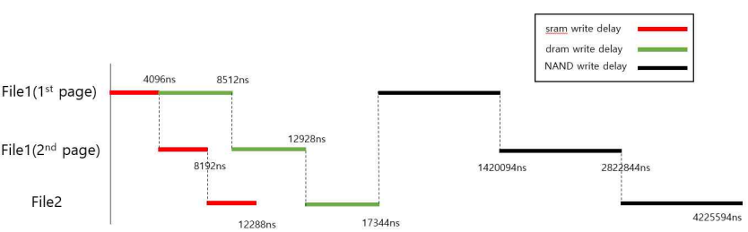

# SSD Simulator

SSD Simulator let you know how SSD works. It shows the access time from master to nand flash.

In SSD, data move in this way.

1. Master -> Sram
2. Sram -> Dram
3. Dram -> Nand flash

(Actually, before third step, data in the Dram go to a buffer first. But I just ignored it in this project. )

I assumed that Sram has two port and Dram has one port.

Since reading from Sram is much more faster than Writing into Dram, Sram reading time can be ignored. For the same reason, Dram reading time can be ignored by Nand flash writing time.

[Figure1] Timing diagram when the master requests to write 3 files.

The result of the simulation will be like this.

[Figure2] Result of SSD Simulator.

You can check how much it takes to store data in SSD. You can even find the sequence of the whole proccess.

# Garbage Collection

 In SSD, Garbage Collection is essential but it cuts the lifespan of SSD. Typical algorithm of Garbage Collection is that the SSD checks the amount of invalid pages in nand flash and when it comes to the threshold value, SSD moves the rest of valid data to somewhere else and clean up the block.

 The problem of this algorithm is that it can make to use specific area over and over. So, I think that SSD should find other blocks that is able to use before just do the Garbage Collection.  

Using SSD simulator, you can check how efficient your SSD management algorithm is. Since it is hard to make a SSD for real, we should check it as simulation first.

# How to use this repo

1. Download this file.
2. You can fix 'files.txt'. It allows you to change the specification of SSD.
3. Build the app using 'Makefile'
  
   if you are using Linux,

        $make

    or, if you use windows you have to install MinGW. After installation, you have to register 'C:\MinGW\bin\' to your PATH(environment variable).
    
    and run this code 

        $mingw32-make

4. you can now run the SSD Simulator by running the code below.

        $.\bin\output.exe
        